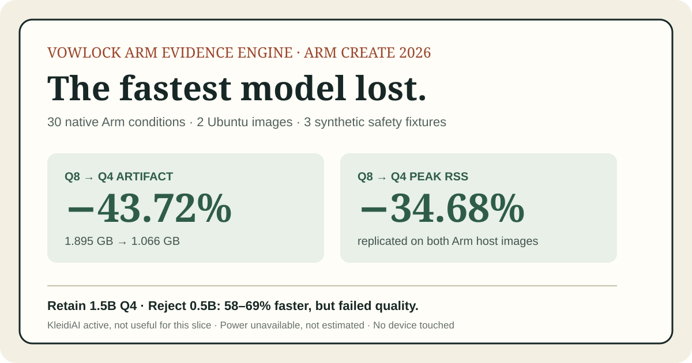

# VowLock Arm Evidence Engine

[](https://github.com/osasisorae/vowlock-arm-evidence-engine/actions/workflows/arm-benchmark.yml)



An Arm64 optimization experiment for the offline explanation layer proposed by VowLock Setup Companion.

This repository asks one narrow question: **does enabling Arm's KleidiAI kernels in `llama.cpp` make the same small local model materially faster on the same Arm cloud machine without changing the model, workload or output-quality test?**

It is being created for the Cloud AI track of the Arm Create: AI Optimization Challenge. It is a new optimization artifact, not a claim that the existing VowLock application or the separate ADTC Setup Companion research scaffold was created during this hackathon.

**Verdict:** KleidiAI was genuinely selected, but the sealed Runs 4–6 showed a mixed near-neutral result: +0.87% prompt processing and -1.58% generation. The project keeps both numbers visible.

Quick links: [live evidence page](https://osasisorae.github.io/vowlock-arm-evidence-engine/) · [replicated results](docs/results.md) · [judge validation](docs/validation.md) · [complete run log](docs/run-log.md) · [Devpost write-up](docs/submission.md)

## Version 2 follow-up

Version 1 is preserved as the sealed answer above. Before running any new condition, Version 2 was separately [pre-registered](docs/v2-protocol.md) in a [machine-readable manifest](experiment.v2.json). It generalizes the artifact across Q8_0 and Q4_0, 1.5B and 0.5B models, three workload shapes and two native Arm Ubuntu images. It adds exact artifact size, cold-process peak RSS, cold first-output proxy, honest power-counter availability and multi-criterion synthetic Setup Companion evaluation.

This is a follow-up study, not a way to pool new numbers into Runs 4–6. It makes no advance speedup or power claim.

Any judge can validate the manifest and deterministic safety evaluator in seconds, without downloading a model:

```bash
python3 v2_matrix.py validate
python3 setup_companion_eval.py demo
```

The full native matrix is owner-dispatched through `.github/workflows/arm-v2.yml` or run on an Arm64 Ubuntu host with:

```bash
./scripts/run-v2.sh
```

The manifest interface is documented in [`docs/customizing-v2.md`](docs/customizing-v2.md); custom studies copy the registration instead of modifying its history.

## Why build this?

Private, offline assistance is not useful if it is too slow, too large or too expensive to run. The challenge supplies a short deadline for converting that concern into evidence. Prize money and recognition would help continue the work, but the minimum useful outcome is a reproducible before/after measurement and an honest decision about whether the improvement matters.

This extends the study of efficient inference from Stanford CS329A. KleidiAI kernel optimization is a systems-layer technique, not an inference-time search operation. The shared discipline is controlled comparison: hold the model, prompts, host and sampling settings fixed; change one runtime feature; measure speed, memory and output validity.

## Pre-registered comparison

| Condition | `llama.cpp` | Model | Host | Changed variable |
|---|---|---|---|---|
| Baseline | pinned revision | Qwen2.5 1.5B Instruct Q4_0 | same Arm64 host | `GGML_CPU_KLEIDIAI=OFF` |
| Optimized | same revision | same file and SHA-256 | same Arm64 host | `GGML_CPU_KLEIDIAI=ON` |

Primary metrics are prompt-processing tokens/second and generation tokens/second from `llama-bench`. Planned secondary evidence includes peak memory, end-to-end response latency and a machine-checked output contract. Failed runs, regressions and unsupported secondary claims remain part of the result.

The pinned model is the official Apache-2.0 Qwen GGUF artifact:

- `qwen2.5-1.5b-instruct-q4_0.gguf`
- size: approximately 1.07 GB
- SHA-256: `dcd819ff094852c38faba6873d8ff0c9d51eadb2844539e52042ae5d647bbfdb`

## Current state

- Benchmark protocol and summarizer: implemented locally.
- Actual Arm64 host: prepared for GitHub's standard `ubuntu-22.04-arm` hosted runner.
- Cost boundary: no paid VM, subscription or metered API is permitted for this experiment.
- Replicated measurement: Runs 4–6 completed from the identical commit on real Arm64 runners. Across their pooled means, KleidiAI changed prompt processing from 129.9529 to 131.0815 tokens/s (+0.87%) and generation from 35.1468 to 34.5907 tokens/s (-1.58%).
- Runtime selection: verified through the optimized `CPU_KLEIDIAI` model buffer and I8MM kernel messages; absent in the baseline.
- Interpretation: the mixed direction replicated and does not demonstrate a material overall speedup under the registered workload. Full table and boundaries: [`docs/results.md`](docs/results.md).
- Quality boundary: Runs 4–6 prove executable inference and backend selection but contain a known unverified output contract. Separately versioned Run 7 repaired the gate: both conditions returned exactly `READY`, and an independent verifier confirmed expected content and equivalence. That narrow canary does not establish explanation usefulness or safety.

## Zero-cost Arm target

The benchmark runs through `.github/workflows/arm-benchmark.yml` on a standard GitHub-hosted Arm64 runner. GitHub documents standard hosted runners as free and unlimited for public repositories. The workflow is manual rather than push-triggered so a source edit cannot accidentally create repeated benchmark jobs.

Making this repository public is also an Arm submission requirement. No benchmark will start until the owner explicitly approves publishing the repository.

## Run on an Arm64 Ubuntu host

Install build requirements:

```bash
sudo apt-get update
sudo apt-get install -y build-essential cmake curl git python3
```

Then run:

```bash
./scripts/build-and-benchmark.sh
```

The script refuses to run on a non-Arm host, verifies the model hash, builds both variants from the same pinned `llama.cpp` commit, verifies that the optimized build actually selects the KleidiAI buffer, checks a deterministic output contract with an independent verifier, and writes raw evidence under `results/`.

Failed and successful attempts are recorded in [`docs/run-log.md`](docs/run-log.md). Setup failures are not counted as performance evidence.

Run the local summarizer tests with:

```bash
python3 -m unittest discover -s tests -v
```

## Honesty boundary

An emulated Arm container may test portability but is not accepted as performance evidence. We will not compare different machines, models, prompts or run counts and call the difference an Arm optimization. If a real Arm host cannot be obtained, or KleidiAI produces no reproducible improvement, the report will say so.

## Prior-work disclosure

VowLock existed before the challenge. This repository is a new optimization artifact created during the submission period: the controlled Arm64 harness, result summarizer, runtime and semantic verifiers, eight-run evidence trail, result report and submission assets. It does not represent the pre-existing VowLock product or separate ADTC Setup Companion scaffold as hackathon-period work.

See [THIRD_PARTY_NOTICES.md](THIRD_PARTY_NOTICES.md) for pinned upstream projects and model licensing.

## License

MIT. See [LICENSE](LICENSE).
